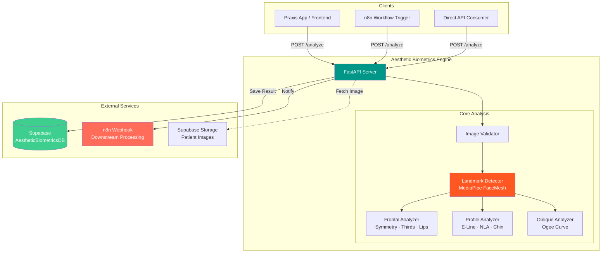
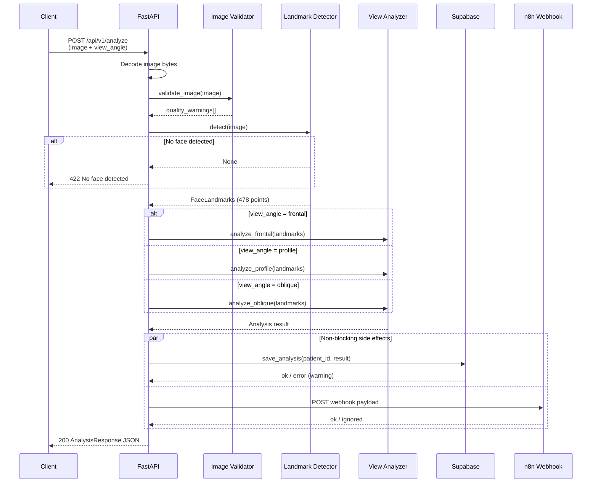
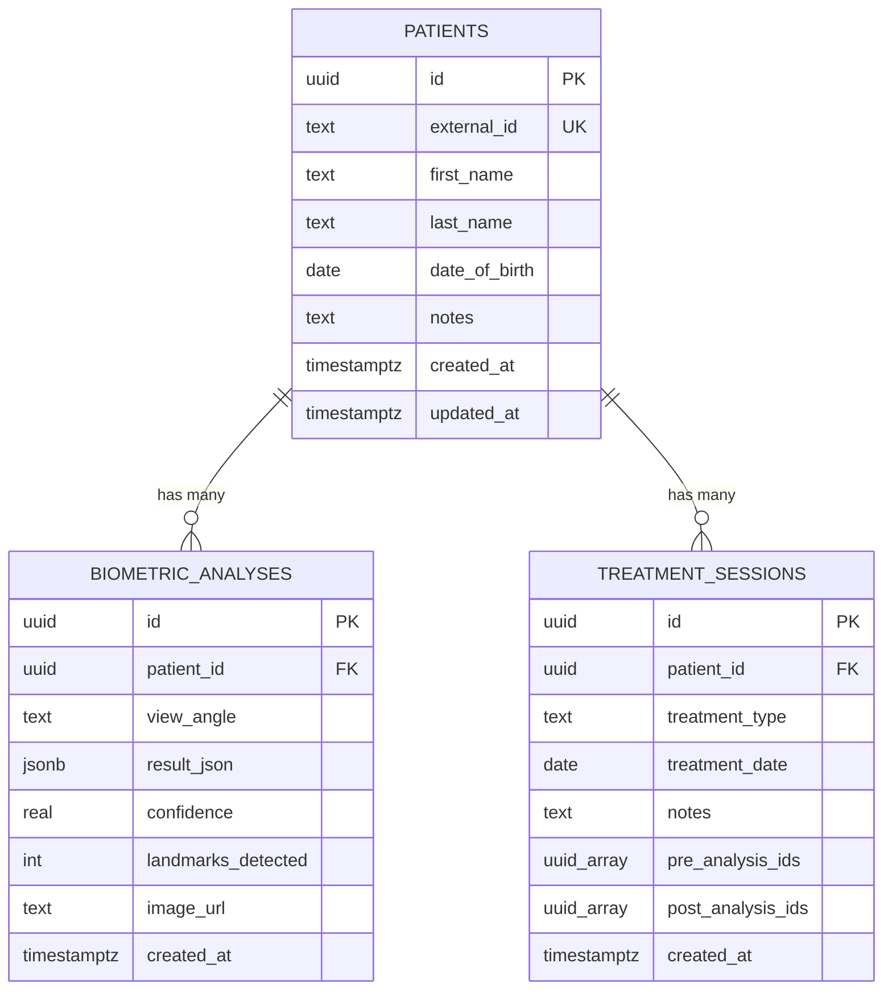
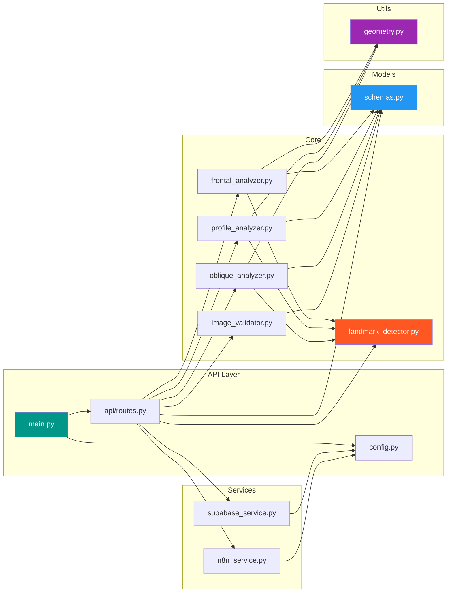
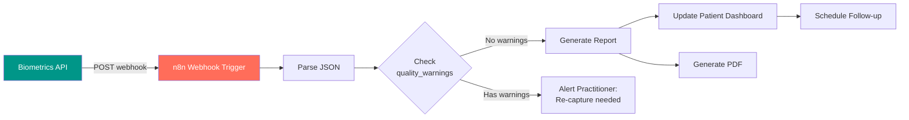

# System Graphs — Aesthetic Biometrics Engine

## System Overview

```mermaid
graph TB
    subgraph Clients
        APP[Praxis App / Frontend]
        N8N_TRIGGER[n8n Workflow Trigger]
        API_CLIENT[Direct API Consumer]
    end

    subgraph "Aesthetic Biometrics Engine"
        FASTAPI[FastAPI Server]

        subgraph "Core Analysis"
            VALIDATOR[Image Validator]
            DETECTOR[Landmark Detector<br/>MediaPipe FaceMesh]
            FRONTAL[Frontal Analyzer<br/>Symmetry · Thirds · Lips]
            PROFILE[Profile Analyzer<br/>E-Line · NLA · Chin]
            OBLIQUE[Oblique Analyzer<br/>Ogee Curve]
        end
    end

    subgraph "External Services"
        SUPABASE[(Supabase<br/>AestheticBiometricsDB)]
        N8N_HOOK[n8n Webhook<br/>Downstream Processing]
        STORAGE[Supabase Storage<br/>Patient Images]
    end

    APP -->|POST /analyze| FASTAPI
    N8N_TRIGGER -->|POST /analyze| FASTAPI
    API_CLIENT -->|POST /analyze| FASTAPI

    FASTAPI --> VALIDATOR
    VALIDATOR --> DETECTOR
    DETECTOR --> FRONTAL
    DETECTOR --> PROFILE
    DETECTOR --> OBLIQUE

    FASTAPI -->|Save Result| SUPABASE
    FASTAPI -->|Notify| N8N_HOOK
    FASTAPI -.->|Fetch Image| STORAGE

    style FASTAPI fill:#009688,color:#fff
    style DETECTOR fill:#FF5722,color:#fff
    style SUPABASE fill:#3ECF8E,color:#fff
    style N8N_HOOK fill:#FF6D5A,color:#fff
```

## Request Processing Flow

```mermaid
sequenceDiagram
    participant C as Client
    participant F as FastAPI
    participant V as Image Validator
    participant D as Landmark Detector
    participant A as View Analyzer
    participant S as Supabase
    participant N as n8n Webhook

    C->>F: POST /api/v1/analyze<br/>(image + view_angle)

    F->>F: Decode image bytes
    F->>V: validate_image(image)
    V-->>F: quality_warnings[]

    F->>D: detect(image)

    alt No face detected
        D-->>F: None
        F-->>C: 422 No face detected
    end

    D-->>F: FaceLandmarks (478 points)

    alt view_angle = frontal
        F->>A: analyze_frontal(landmarks)
    else view_angle = profile
        F->>A: analyze_profile(landmarks)
    else view_angle = oblique
        F->>A: analyze_oblique(landmarks)
    end

    A-->>F: Analysis result

    par Non-blocking side effects
        F->>S: save_analysis(patient_id, result)
        S-->>F: ok / error (warning)
    and
        F->>N: POST webhook payload
        N-->>F: ok / ignored
    end

    F-->>C: 200 AnalysisResponse JSON
```

## Data Model (ER Diagram)

```mermaid
erDiagram
    PATIENTS {
        uuid id PK
        text external_id UK
        text first_name
        text last_name
        date date_of_birth
        text notes
        timestamptz created_at
        timestamptz updated_at
    }

    BIOMETRIC_ANALYSES {
        uuid id PK
        uuid patient_id FK
        text view_angle
        jsonb result_json
        real confidence
        int landmarks_detected
        text image_url
        timestamptz created_at
    }

    TREATMENT_SESSIONS {
        uuid id PK
        uuid patient_id FK
        text treatment_type
        date treatment_date
        text notes
        uuid_array pre_analysis_ids
        uuid_array post_analysis_ids
        timestamptz created_at
    }

    PATIENTS ||--o{ BIOMETRIC_ANALYSES : "has many"
    PATIENTS ||--o{ TREATMENT_SESSIONS : "has many"
```

## Module Dependency Graph

```mermaid
graph LR
    subgraph "API Layer"
        MAIN[main.py]
        ROUTES[api/routes.py]
        CONFIG[config.py]
    end

    subgraph "Core"
        LD[landmark_detector.py]
        IV[image_validator.py]
        FA[frontal_analyzer.py]
        PA[profile_analyzer.py]
        OA[oblique_analyzer.py]
    end

    subgraph "Models"
        SCHEMAS[schemas.py]
    end

    subgraph "Services"
        SUPA[supabase_service.py]
        N8NS[n8n_service.py]
    end

    subgraph "Utils"
        GEO[geometry.py]
    end

    MAIN --> ROUTES
    MAIN --> CONFIG
    ROUTES --> LD
    ROUTES --> IV
    ROUTES --> FA
    ROUTES --> PA
    ROUTES --> OA
    ROUTES --> SUPA
    ROUTES --> N8NS
    ROUTES --> SCHEMAS

    FA --> LD
    PA --> LD
    OA --> LD
    FA --> GEO
    PA --> GEO
    OA --> GEO
    FA --> SCHEMAS
    PA --> SCHEMAS
    OA --> SCHEMAS
    IV --> SCHEMAS

    SUPA --> CONFIG
    N8NS --> CONFIG

    style MAIN fill:#009688,color:#fff
    style LD fill:#FF5722,color:#fff
    style SCHEMAS fill:#2196F3,color:#fff
    style GEO fill:#9C27B0,color:#fff
```

## n8n Integration Flow

```mermaid
graph LR
    API[Biometrics API] -->|POST webhook| WH[n8n Webhook Trigger]
    WH --> PARSE[Parse JSON]
    PARSE --> COND{Check<br/>quality_warnings}

    COND -->|No warnings| REPORT[Generate Report]
    COND -->|Has warnings| NOTIFY[Alert Practitioner:<br/>Re-capture needed]

    REPORT --> DASH[Update Patient Dashboard]
    REPORT --> PDF[Generate PDF]
    DASH --> SCHEDULE[Schedule Follow-up]

    style API fill:#009688,color:#fff
    style WH fill:#FF6D5A,color:#fff
```
