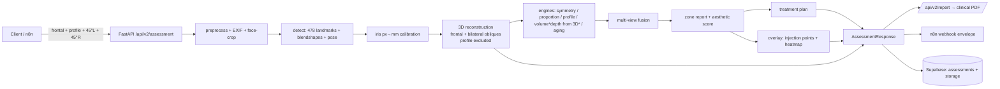
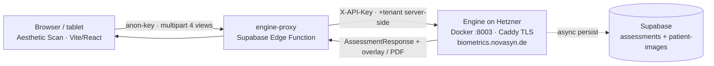
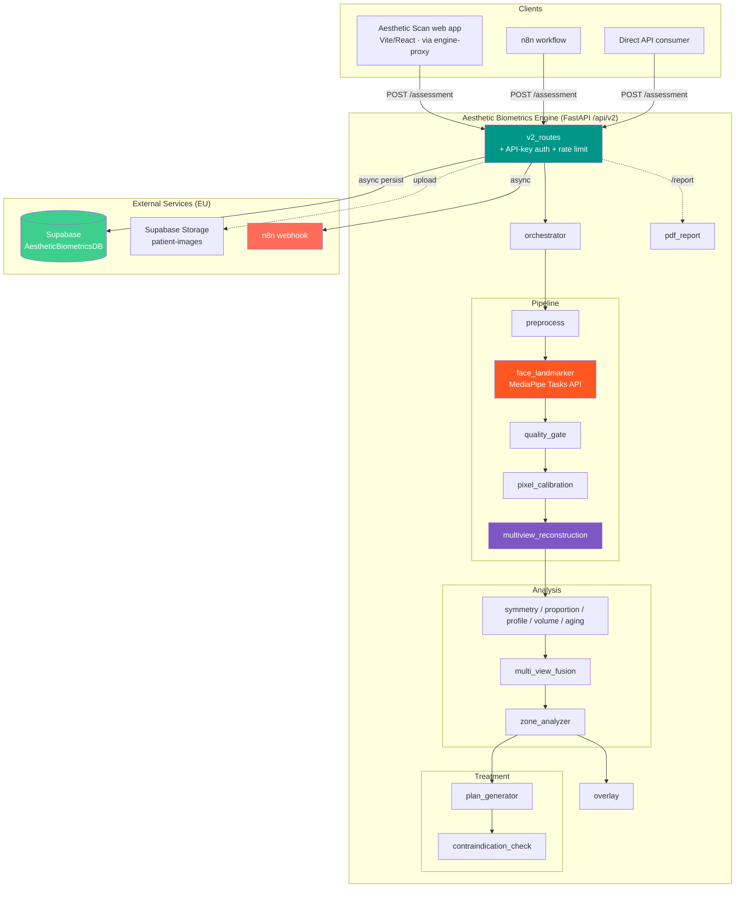
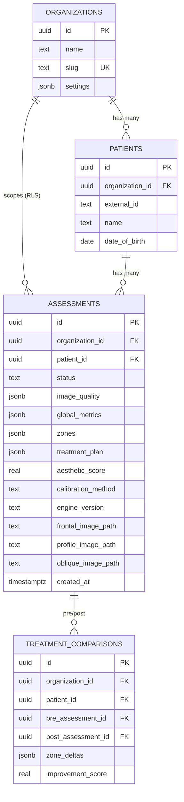
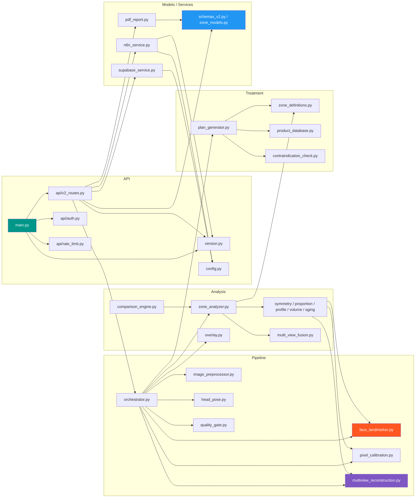
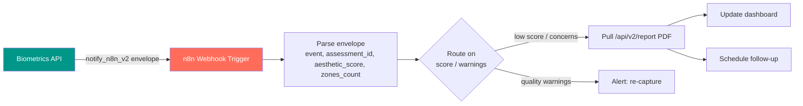

# System Graphs — Aesthetic Biometrics Engine (V2)

> Diagrams for the current V2 engine (`/api/v2`, zone-based, engine v2.2.0). The V1
> single-image API (`/api/v1/analyze`) was removed.

## V2 Pipeline (`POST /api/v2/assessment`)



Key stages unique to V2: the **3D reconstruction** (before the engines; volume depth reads
from it, negated), **bilateral obliques**, the **overlay** block, and the **PDF report**.

## Frontend Delivery (Sprint 14)



The browser never holds the engine key; the proxy injects the tenant. `canonical_oblique_view`
in the overlay tells the UI which physical oblique photo to paint the oblique heatmap on.

## System Overview



## Request Processing Flow

```mermaid
sequenceDiagram
    participant C as Client
    participant F as FastAPI (v2_routes)
    participant O as Orchestrator
    participant P as Pipeline (preprocess/detect/pose/calibrate)
    participant R as Reconstruction
    participant Z as Zone Analyzer (+engines+fusion)
    participant T as Plan + Overlay
    participant S as Supabase / n8n

    C->>F: POST /api/v2/assessment<br/>(frontal, profile, 45°L, 45°R)
    F->>F: auth (X-API-Key), size checks
    F->>O: run_pipeline(...)
    loop each provided view
        O->>P: preprocess → detect → pose gate → calibrate
        alt no face / hard pose reject
            P-->>O: view rejected
        end
    end
    alt no usable view
        O-->>F: error
        F-->>C: 422 No face / analysis failed
    end
    O->>R: reconstruct_from_views(frontal + obliques)<br/>(profile excluded; iris-gated)
    R-->>O: 3D point cloud (or None → relative-z fallback)
    O->>Z: analyze(views, reconstruction)
    Z-->>O: zone report + aesthetic score
    O->>T: plan_generate + build_overlay
    T-->>O: plan + overlay
    O-->>F: PipelineResult
    F-->>C: 200 AssessmentResponse
    par Non-blocking (if organization_id + Supabase)
        F->>S: persist assessment + upload images + n8n envelope
    end
```

## Data Model (ER Diagram, V2)



> Legacy V1 tables `biometric_analyses` and `treatment_sessions` remain in the DB but are
> unused by V2.

## Module Dependency Graph



## n8n Integration Flow


