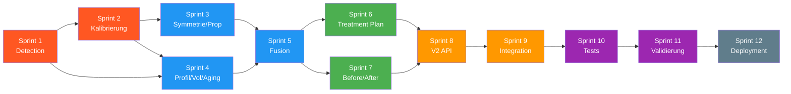

# Sprint Plan — Aesthetic Biometrics Engine V2

> 12 Sprints, 6 Phasen. Jeder Sprint ≈ 1 Woche mit Claude, ≈ 2 Wochen manuell.
> Startdatum: 18.03.2026

---

## Uebersicht

```
Phase 1 ██████░░░░░░░░░░░░░░░░░░  Detection Layer     Sprint 1-2
Phase 2 ░░░░░░██████████░░░░░░░░  Zone-System          Sprint 3-5
Phase 3 ░░░░░░░░░░░░░░░░████░░░░  Treatment Intel.     Sprint 6-7
Phase 4 ░░░░░░░░░░░░░░░░░░░░████  API + Integration    Sprint 8-9
Phase 5 ░░░░░░░░░░░░░░░░░░░░████  Validation           Sprint 10-11
Phase 6 ░░░░░░░░░░░░░░░░░░░░░░██  Deployment           Sprint 12
```

---

## Sprint 1 — MediaPipe Tasks API + Preprocessing
**Phase:** 1 (Detection Layer)
**Ziel:** Neues Detection-Fundament steht

| # | Task | Datei | Abhaengigkeit |
|---|------|-------|---------------|
| 1.1 | Face Landmarker `.task` Model herunterladen | `models/` | — |
| 1.2 | Neuer Landmarker-Wrapper (Tasks API) | `detection/face_landmarker.py` | 1.1 |
| 1.3 | Blendshape-Extraktion (52 Werte) | `detection/face_landmarker.py` | 1.2 |
| 1.4 | Transformation Matrix → Head Pose | `detection/head_pose.py` | 1.2 |
| 1.5 | Landmark-Index mit anatomischen Gruppen | `detection/landmark_index.py` | — |
| 1.6 | Image Preprocessor (EXIF, Resize, Normalize) | `pipeline/image_preprocessor.py` | — |
| 1.7 | Quality Gate (erweiterter Validator) | `pipeline/quality_gate.py` | 1.6 |

**Deliverable:** `face_landmarker.detect(image)` → Landmarks + Blendshapes + Pose
**Validierung:** Unit Test mit Testbild, alle 478 Landmarks + 52 Blendshapes vorhanden

---

## Sprint 2 — Iris-Kalibrierung + Geometrie
**Phase:** 1 (Detection Layer)
**Ziel:** Alle Messungen in echten Millimetern

| # | Task | Datei | Abhaengigkeit |
|---|------|-------|---------------|
| 2.1 | Iris-basierte px→mm Kalibrierung | `utils/pixel_calibration.py` | Sprint 1 |
| 2.2 | Fallback auf Face-Width wenn Iris-Confidence niedrig | `utils/pixel_calibration.py` | 2.1 |
| 2.3 | Face-Crop Normalisierung (Lens Distortion) | `pipeline/image_preprocessor.py` | 1.6 |
| 2.4 | 3D-Geometrie-Operationen (z-Achse nutzen) | `utils/geometry.py` | — |
| 2.5 | Head-Pose-Validation (Schwellenwert) | `pipeline/quality_gate.py` | 1.4 |
| 2.6 | Unit Tests Kalibrierung + Geometrie | `tests/` | 2.1-2.4 |
| 2.7 | Benchmark: Iris-Kal. vs. V1-Schaetzung | `tests/` | 2.1 |

**Deliverable:** `calibrate(landmarks) → px_per_mm` mit < 5% Fehler + Lens Distortion Fix
**Validierung:** Vergleich gegen bekannten Massstab auf Testbildern

---

## Sprint 3 — Zone-Definitionen + Symmetrie + Proportionen
**Phase:** 2 (Zone-System)
**Ziel:** Die 16 Zonen sind definiert, Symmetrie und Proportionen messen in mm

| # | Task | Datei | Abhaengigkeit |
|---|------|-------|---------------|
| 3.1 | 16 Zone-Definitionen mit Landmark-Mapping | `treatment/zone_definitions.py` | 1.5 |
| 3.2 | Zone Pydantic Models | `models/zone_models.py` | 3.1 |
| 3.3 | Symmetrie-Engine (6 Achsen, pro-Zone) | `analysis/symmetry_engine.py` | Sprint 2 |
| 3.4 | Dynamische Asymmetrie (Blendshapes) | `analysis/symmetry_engine.py` | 1.3 |
| 3.5 | Proportionen: Drittel, Fuenftel, Golden Ratio | `analysis/proportion_engine.py` | Sprint 2 |
| 3.6 | Lip Ratio + Cupid's Bow Analyse | `analysis/proportion_engine.py` | Sprint 2 |
| 3.7 | Unit Tests | `tests/` | 3.3-3.6 |

**Deliverable:** `symmetry_engine.analyze()` + `proportion_engine.analyze()` → Zone-Scores
**Validierung:** Symmetrisches Gesicht → Score > 95; bewusst asymmetrisch → Score < 70

---

## Sprint 4 — Profil, Volumen, Aging Engines
**Phase:** 2 (Zone-System)
**Ziel:** Alle medizinischen Messungen implementiert

| # | Task | Datei | Abhaengigkeit |
|---|------|-------|---------------|
| 4.1 | Profil-Engine: E-Line, NLA, Chin (in mm) | `analysis/profile_engine.py` | Sprint 2 |
| 4.2 | Profil-Engine: Nasal dorsum, Steiner line | `analysis/profile_engine.py` | 4.1 |
| 4.3 | Profil-Engine: Cervicomental angle | `analysis/profile_engine.py` | 4.1 |
| 4.4 | Volumen-Engine: Ogee Curve (mit 3D-Depth) | `analysis/volume_engine.py` | Sprint 2 |
| 4.5 | Volumen-Engine: Temporal, Tear Trough, Jowl | `analysis/volume_engine.py` | 4.4 |
| 4.6 | Aging-Engine: Blendshape-Muster | `analysis/aging_engine.py` | 1.3 |
| 4.7 | Aging-Engine: Gravitationelle Drift | `analysis/aging_engine.py` | Sprint 2 |
| 4.8 | Unit Tests alle drei Engines | `tests/` | 4.1-4.7 |

**Deliverable:** 3 neue Engines die Zone-spezifische Findings produzieren
**Validierung:** Bekannte klinische Faelle korrekt erkannt

---

## Sprint 5 — Multi-View Fusion + Zone Analyzer
**Phase:** 2 (Zone-System)
**Ziel:** 3 Views → 1 fusioniertes Zone-Profil

| # | Task | Datei | Abhaengigkeit |
|---|------|-------|---------------|
| 5.1 | Multi-View Fusion: Landmark-only (KEINE Blendshape-Fusion!) | `analysis/multi_view_fusion.py` | Sprint 3-4 |
| 5.2 | Fusion: Widerspruechs-Erkennung zwischen Views | `analysis/multi_view_fusion.py` | 5.1 |
| 5.3 | Neutral-Expression Validation (Blendshape-Check) | `pipeline/quality_gate.py` | Sprint 1 |
| 5.4 | Zone Analyzer: Orchestrierung aller Engines | `analysis/zone_analyzer.py` | 5.1 |
| 5.5 | Zone Analyzer: Findings-Textgenerierung | `analysis/zone_analyzer.py` | 5.4 |
| 5.6 | Zone Analyzer: Severity-Ranking | `analysis/zone_analyzer.py` | 5.4 |
| 5.7 | Aesthetic Score (Composite KPI, 0-100) | `analysis/zone_analyzer.py` | 5.6 |
| 5.8 | Integration Test: 3 Bilder → Zone Report | `tests/` | 5.1-5.7 |

**Deliverable:** `zone_analyzer.analyze(frontal, profile, oblique)` → Zone-Report + Aesthetic Score
**Validierung:** 3 Testbilder ergeben plausiblen Report; Blendshapes pro View separat

---

## Sprint 6 — Behandlungsplan-Generator
**Phase:** 3 (Treatment Intelligence)
**Ziel:** Zone-Report → konkreter Behandlungsplan

| # | Task | Datei | Abhaengigkeit |
|---|------|-------|---------------|
| 6.1 | Produkt-Datenbank (Filler + Botox) | `treatment/product_database.py` | — |
| 6.2 | Zone → Produkt Matching-Logik | `treatment/plan_generator.py` | 6.1, 3.1 |
| 6.3 | Severity-basierte Priorisierung | `treatment/plan_generator.py` | 6.2 |
| 6.4 | Klinische Reihenfolge (Struktur → Detail) | `treatment/plan_generator.py` | 6.3 |
| 6.5 | Sitzungsplanung + Volumen-Schaetzung | `treatment/plan_generator.py` | 6.4 |
| 6.6 | Kontraindikations-Check | `treatment/contraindication_check.py` | 3.1 |
| 6.7 | Unit Tests Plan Generator | `tests/` | 6.1-6.6 |

**Deliverable:** `plan_generator.generate(zones)` → priorisierter Behandlungsplan
**Validierung:** Midface-Volume-Loss → Voluma empfohlen, korrekte Reihenfolge

---

## Sprint 7 — Before/After Vergleich
**Phase:** 3 (Treatment Intelligence)
**Ziel:** Behandlungserfolg messbar machen

| # | Task | Datei | Abhaengigkeit |
|---|------|-------|---------------|
| 7.1 | Delta-Berechnung pro Zone | `analysis/comparison_engine.py` | Sprint 5 |
| 7.2 | Verbesserungs-Score | `analysis/comparison_engine.py` | 7.1 |
| 7.3 | Heatmap-Daten fuer Frontend | `analysis/comparison_engine.py` | 7.1 |
| 7.4 | Supabase: treatment_comparisons Tabelle | Migration | — |
| 7.5 | Unit Tests Comparison | `tests/` | 7.1-7.3 |

**Deliverable:** `compare(pre, post)` → Delta pro Zone + Gesamtverbesserung
**Validierung:** Bekannter Vorher/Nachher Fall → positive Deltas in behandelten Zonen

---

## Sprint 8 — V2 API + Supabase V2 Schema
**Phase:** 4 (API + Integration)
**Ziel:** Neuer Endpoint steht, Daten fliessen

| # | Task | Datei | Abhaengigkeit |
|---|------|-------|---------------|
| 8.1 | Pydantic V2 Schemas (komplett neu) | `models/schemas.py` | Sprint 5-6 |
| 8.2 | `POST /api/v2/assessment` Endpoint | `api/v2_routes.py` | 8.1 |
| 8.3 | `POST /api/v2/compare` Endpoint | `api/v2_routes.py` | 7.1, 8.1 |
| 8.4 | `GET /api/v2/patients/{id}/history` | `api/v2_routes.py` | 8.1 |
| 8.5 | Supabase Schema Migration V2 (mit organization_id!) | Migration | — |
| 8.6 | Multi-Tenant RLS Policies (Org-Isolation) | Migration | 8.5 |
| 8.7 | Supabase Storage Bucket einrichten | Supabase | — |
| 8.8 | Pipeline Orchestrator | `pipeline/orchestrator.py` | Sprint 1-6 |

**Deliverable:** Funktionierender V2-Endpoint mit Multi-Tenant Isolation
**Validierung:** curl/Swagger Test + RLS-Pruefung: Org A sieht keine Daten von Org B

---

## Sprint 9 — n8n + Async + Legacy Compat
**Phase:** 4 (API + Integration)
**Ziel:** Produktionsreife Integration

| # | Task | Datei | Abhaengigkeit |
|---|------|-------|---------------|
| 9.1 | n8n Webhook an V2-Payload anpassen | `services/n8n_service.py` | 8.1 |
| 9.2 | BackgroundTasks: Supabase + Storage async | `api/v2_routes.py` | 8.2 |
| 9.3 | Partial-Failure Handling (1 View fehlt) | `pipeline/orchestrator.py` | 8.7 |
| 9.4 | Structured JSON Logging | `utils/logging.py` | — |
| 9.5 | V1 Legacy Endpoints beibehalten | `api/v1_routes.py` | — |
| 9.6 | Integration Test: Full Pipeline + Supabase | `tests/` | 9.1-9.5 |

**Deliverable:** Robuste Pipeline die auch bei Teilfehlern sinnvolle Ergebnisse liefert
**Validierung:** 1 schlechtes Bild von 3 → Partial-Assessment mit Warnungen

---

## Sprint 10 — Test-Suite
**Phase:** 5 (Validation)
**Ziel:** Vertrauen in jede Komponente

| # | Task | Bereich |
|---|------|---------|
| 10.1 | Unit Tests: Alle Analyse-Engines | `tests/analysis/` |
| 10.2 | Unit Tests: Zone-Definitionen (16 Zonen) | `tests/treatment/` |
| 10.3 | Unit Tests: Plan Generator | `tests/treatment/` |
| 10.4 | Integration Tests: Full Pipeline | `tests/integration/` |
| 10.5 | Edge Cases: kein Gesicht, Brille, Bart | `tests/edge_cases/` |
| 10.6 | Blendshape Tests: Ruhe vs. Ausdruck | `tests/analysis/` |

**Deliverable:** > 80% Code Coverage, alle Tests gruen
**Validierung:** `pytest tests/ -v --cov` → alle bestanden

---

## Sprint 11 — Klinische Validierung
**Phase:** 5 (Validation)
**Ziel:** Medizinisch korrekte Ergebnisse

| # | Task | Bereich |
|---|------|---------|
| 11.1 | Messungen gegen klinische Referenzdaten | Manuell + Tests |
| 11.2 | Iris-Kalibrierung mit physischem Massstab | Manuell |
| 11.3 | Diverse Demographien testen | Test-Set erweitern |
| 11.4 | Behandlungsplan-Review (klinisch) | Manuell |
| 11.5 | Severity-Schwellenwerte kalibrieren | `treatment/zone_definitions.py` |
| 11.6 | Performance: < 3s fuer 3-Bild-Assessment | Benchmark |

**Deliverable:** Validierter, kalibrierter Engine mit klinischem Sign-Off
**Validierung:** Klinischer Berater bestaetigt Plausibilitaet der Behandlungsplaene

---

## Sprint 12 — Deployment
**Phase:** 6 (Production)
**Ziel:** Live

| # | Task | Bereich |
|---|------|---------|
| 12.1 | Docker Multi-stage Build (< 1.5GB) | `Dockerfile` |
| 12.2 | Railway Deployment | DevOps |
| 12.3 | API Key Authentication | `api/auth.py` |
| 12.4 | Rate Limiting | Middleware |
| 12.5 | CI/CD: GitHub Actions | `.github/workflows/` |
| 12.6 | Swagger/OpenAPI Docs finalisieren | FastAPI auto |
| 12.7 | DSGVO-Checkliste | Docs |

**Deliverable:** Laufender Service auf Railway mit Auth + Monitoring
**Validierung:** Externer API-Call mit Auth → vollstaendiges Assessment

---

## Sprint-Abhaengigkeiten



---

## Meilensteine

| Meilenstein | Nach Sprint | Was steht |
|---|---|---|
| **M1: Detection Ready** | Sprint 2 | Neue API, Iris-Kal., Head Pose |
| **M2: Zone Analysis** | Sprint 5 | 16 Zonen mit Severity aus 3 Views |
| **M3: Treatment Plan** | Sprint 7 | Vollstaendiger Behandlungsplan |
| **M4: API Complete** | Sprint 9 | V2 Endpoints, Supabase, n8n |
| **M5: Validated** | Sprint 11 | Klinisch validiert, getestet |
| **M6: Production** | Sprint 12 | Live auf Railway |
